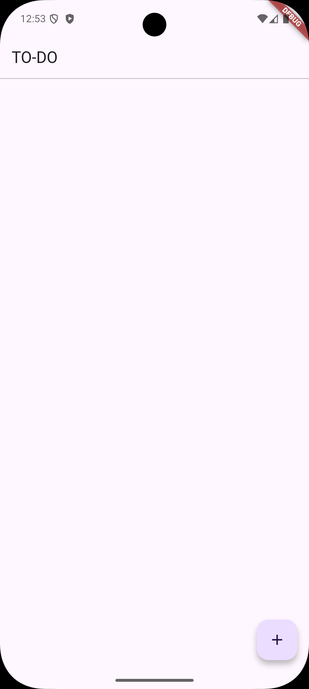
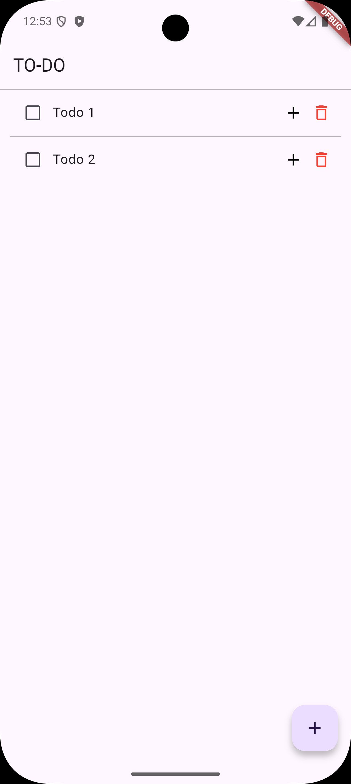
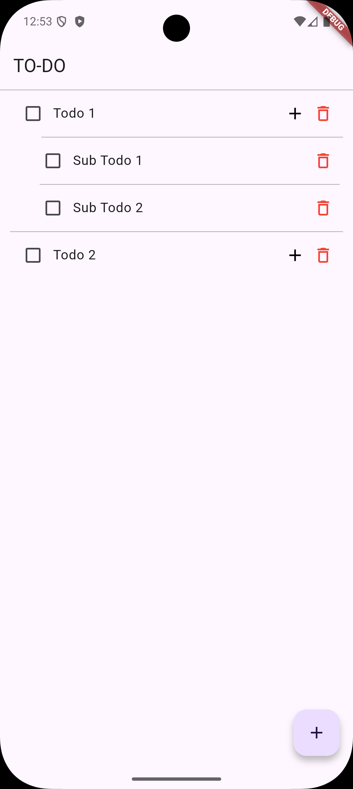

# Flutter Todo App

A simple and elegant Todo App built using Flutter, with support for:

- Adding main todos

- Adding sub-todos to each main todo

- Check/uncheck todos

- Delete todos and sub-todos

## Features

- Add, check, and delete todos

- Add sub-tasks (nested todos)

- Clean and minimal UI

- Modular and optimized code structure

  
